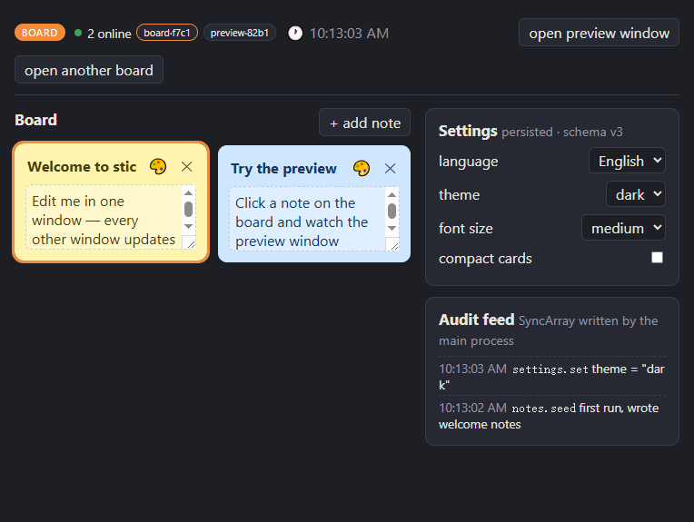
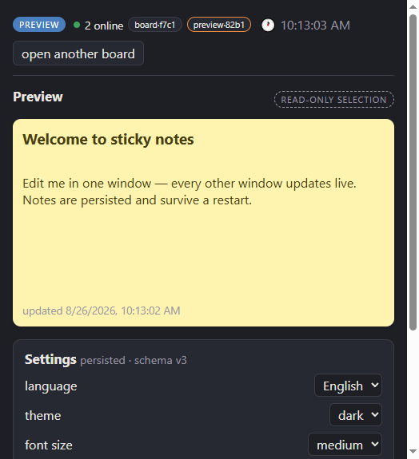
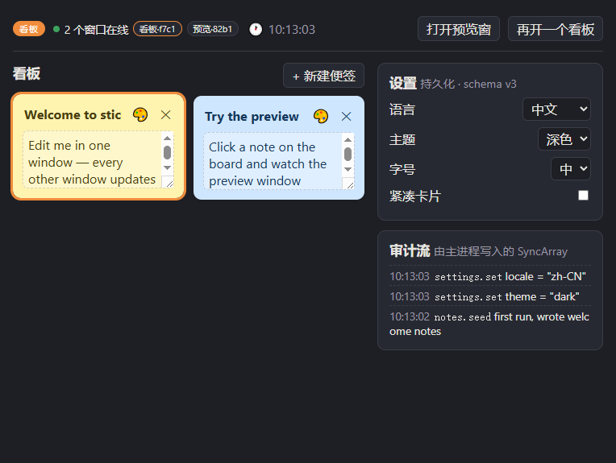

# cross-window-state — sticky notes example

A realistic multi-window app: a **sticky-notes board** with a read-only **preview** window,
built with **Vue 3** composables. The exact same renderer code also runs as plain browser
tabs (web mode: BroadcastChannel + localStorage).





## What it demonstrates

| Feature                     | Where you see it                                                             |
| --------------------------- | ---------------------------------------------------------------------------- |
| `useStorageState` (Vue)     | notes list + settings panel — edit in one window, all windows update         |
| `useRuntimeState` (Vue)     | the selected note — click a card on the board, the preview window follows    |
| `readonly` option           | the preview window holds a **read-only** handle on the selection             |
| versioned migration         | `settings` is schema **v3** — run the seed script below to watch v1 migrate  |
| persistence                 | notes + theme + language survive a full app restart                          |
| language switch             | 中文/English lives in the settings state — switch once, every window follows |
| `SyncArray` (single writer) | the audit feed — appended by the **main process** on every settings change   |
| main → windows writes       | the status-bar clock, ticked by the main process once per second             |
| multi-writer runtime state  | presence — every window adds itself and removes itself on close              |
| web mode (no Electron)      | open two browser tabs of the same page — everything above still syncs        |

## Run (Electron)

```bash
# from the repository root — one command (builds the library first):
pnpm install
pnpm example:notes
```

Equivalent long form / production bundle:

```bash
pnpm build                                                # build the library (dist/)
pnpm --filter cross-window-state-example-notes dev        # dev mode (HMR)
# or build + run the production bundle:
pnpm --filter cross-window-state-example-notes build
pnpm --filter cross-window-state-example-notes start
```

The app opens a **board** window and a **preview** window. Try:

- click a note on the board → the preview window renders it (runtime state)
- edit a title → the preview updates as you type (storage state, debounced writes)
- switch theme to `dark` in either window → both restyle live, and the main
  process appends to the audit feed
- quit and relaunch → notes and settings are still there

## Run (web mode)

```bash
# from the repository root — one command (builds library + web bundle):
pnpm example:notes:web
```

Open the printed URL (default http://localhost:4173) in **two tabs**; add
`?role=preview` for the preview view. Runtime state syncs via
`BroadcastChannel`, storage state via `localStorage`. The main-process clock
and audit feed are Electron-only (marked in the UI).

## Watch a v1 → v3 migration

```bash
# write a v1-shaped settings file (dark theme, large font, plus a legacy key)
node examples/notes/scripts/seed-v1-settings.mjs /tmp/cws-demo

# launch against it — the store migrates on first read: keeps
# theme=dark / fontScale=large, drops `legacyOption`, adds `compact` + `locale`
CWS_USER_DATA=/tmp/cws-demo pnpm --filter cross-window-state-example-notes start
```

The migrated file is written back immediately; see
`<userData>/cross-window-state/notes-settings.json`.

## Layout

```
examples/notes/
├── src/shared/notes.ts        # schema shared by main + renderer (names, defaults, versions)
├── src/main/index.ts          # two window roles, seeding, clock tick, SyncArray audit feed
├── src/preload/index.ts       # library bridge + demo-only window opener
├── src/renderer/
│   ├── composables/           # useNotes / useSettings / useSelection / usePresence / useClock / useAudit
│   ├── components/            # BoardView, PreviewView, SettingsPanel, StatusBar, AuditFeed
│   └── App.vue
├── web/index.html             # the same Vue app as a browser page
└── scripts/seed-v1-settings.mjs
```

## Design notes

- **Notes are storage state, selection is runtime state.** Content must survive
  a restart; selection is UI ephemera. The split is the point of the library.
- **SyncArray has one writer.** Its internal data only advances on its own
  commits, so the audit feed is written exclusively by the main process.
  Presence is multi-writer and therefore uses read-modify-write on the latest
  `state.state` instead — see `composables/usePresence.ts`.
- **Presence uses heartbeats.** Presence is multi-writer (every window adds and
  removes itself), so each window re-announces itself every 2 s and prunes
  entries quiet for 7 s — a late-joining tab converges within one heartbeat,
  and a killed window disappears instead of lingering.
- **Late-joining tabs hydrate runtime state from live peers.** A preview tab
  opened after a selection was made still shows it — the library asks sibling
  tabs for the current value (memory-only, nothing is persisted).
